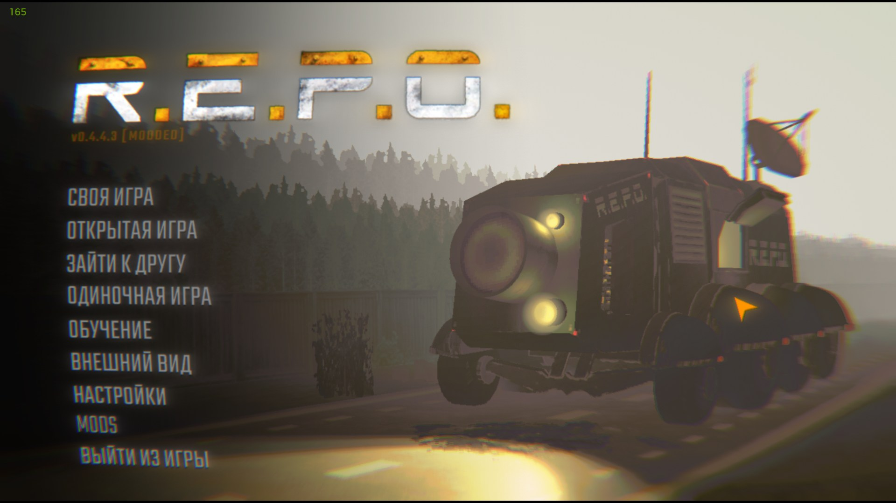
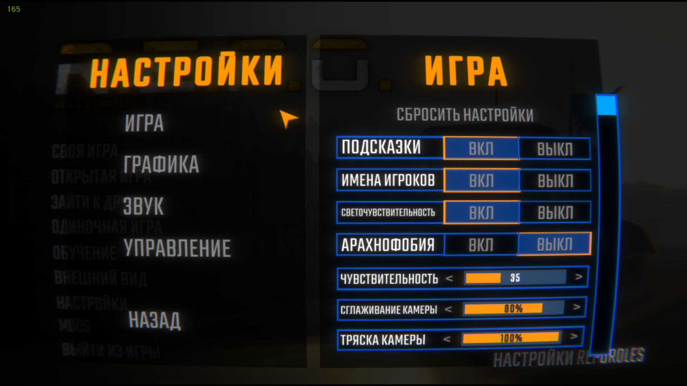
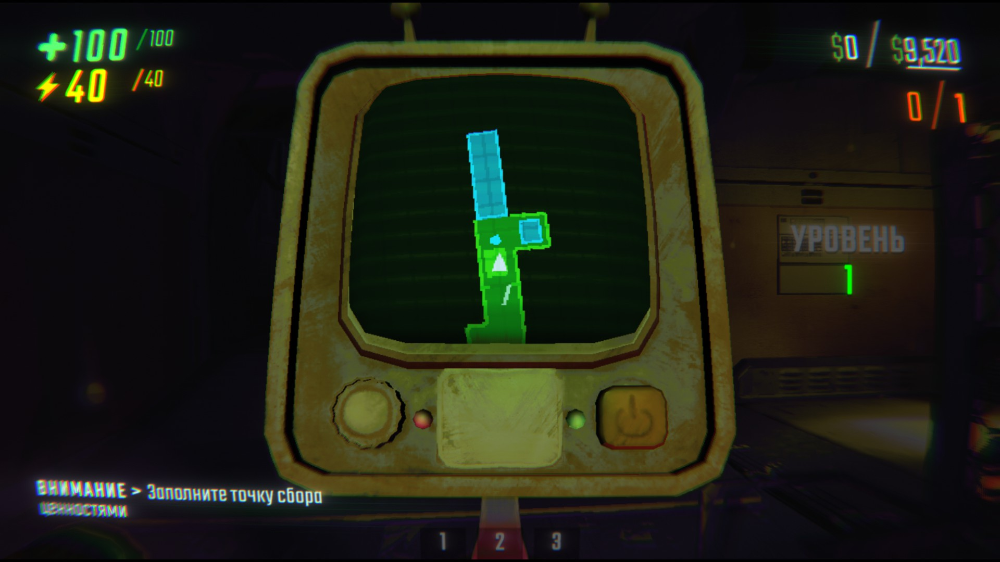
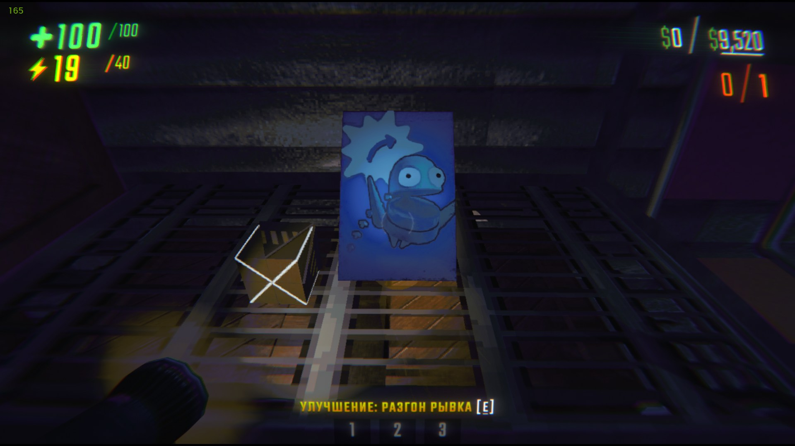
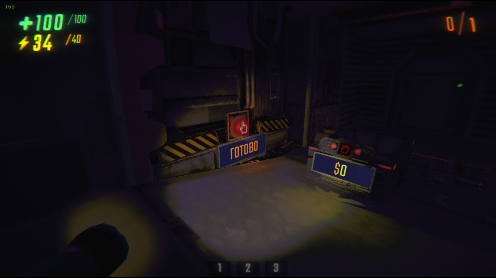

# REPO_Russian_Translate

Исходники русификатора **Sweet Russian Translate** для игры R.E.P.O.

Мод на Thunderstore: <https://thunderstore.io/c/repo/p/Sweet_team/Sweet_Russian_Translate/>

Перевод не подменяет надписи на лету, а отдаёт текст в штатную систему
локализации самой игры — ту, для которой разработчики положили инструкцию в
`REPO_Data/StreamingAssets/Localizations/Default/readme.txt`.

## Как выглядит











## Что где лежит

| Папка | Что внутри |
|---|---|
| `mod/` | всё, что попадает в архив для Thunderstore: манифест, иконка, шрифт, TSV с переводами |
| `src/` | исходники плагина и скрипт сборки `pack.py` |
| `screenshots/` | картинки для страницы мода |

Переводы лежат в `mod/*.tsv`:

- `Game.tsv`, `HUD.tsv`, `Menu.tsv` — штатная локализация игры, 603 строки;
- `Hardcoded.tsv` — надписи, вшитые в код мимо локализации;
- `Chat.tsv` — реплики, которые персонаж пишет в чат и произносит вслух.

## Сборка

```
python src/pack.py
```

Скрипт собирает DLL, проверяет, что версия одинаковая в `manifest.json`,
`.csproj` и `Plugin.cs`, пакует архив в корень проекта и раскладывает файлы в
папку профиля Thunderstore для проверки в игре.

Правки TSV пересборки не требуют — но в архив они попадут только после запуска
скрипта.

## Лицензии

- код и переводы — MIT, см. `LICENSE`;
- шрифт `Teko-Cyrillic.ttf` — SIL Open Font License 1.1, см. `mod/OFL.txt`;
- скриншоты сделаны в игре R.E.P.O., права на изображения игры принадлежат Semiwork.
